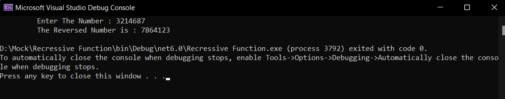

# Recursive-function

## Aim: 
To write a C# program to reverse a number using recursive function.

## Algorithm:
### Step1:
Create a function for reversing.

### Step2:
Get the number from the user.

### Step3:
In the function find reminder of the number and multiply it by 10 and add the reverse number.

### Step4:
Recusively call this function to get the reversed number.

### Step5:
print the reversed number.
## Program:
```C#
using System;
namespace Exercise
{
    class Program
    {
        
        int rem = 0, rev = 0;
        public int reverse(int n)
        {
            rem = n % 10;
            if(rem == 0) return rev;
            else
            {
                rev = rev * 10 + rem;
                return reverse(n / 10);
            }
        }
        static void Main(string[] args)
        {
            int n;
            Console.Write("\t Enter The Number : ");
            n = Convert.ToInt32(Console.ReadLine());

            Program pro = new Program();
            Console.WriteLine("\t The Reversed Number is : " + pro.reverse(n));
        }
    }
}
```
## Output:

## Result:
Thus the C# program to reverse a number using recursive function is executed successfully.

